# Sarvam AI Multilingual Voice Assistant

An intelligent, multilingual voice assistant built using the Sarvam AI platform. This is not a simple chatbot; it is a sophisticated conversational agent designed to guide a user through a structured data collection process, validate their responses in real-time using an LLM, and save the clean data to a database.  
The primary use case demonstrated is a job application portal (JobsUPI), but the underlying engine can be easily adapted for any structured data-gathering task, such as lead generation, user onboarding, or customer surveys.

## Demo

(Will put soon!!)

## Core Features

* **🎙️ Real-time Voice Interaction:** Continuous listening with automatic voice activity detection. The assistant waits for you to pause before processing your speech.
* **🌐 Multilingual Support:** The assistant starts by asking the user for their preferred language and conducts the entire conversation—including questions and error messages—in that language.
* **🧠 LLM-Powered Validation:** User responses for complex fields (like name, city, job role, and even numbers) are sent to a Sarvam LLM with a specific prompt to validate, normalize, and extract the correct information.
* **🗣️ Dynamic & Contextual Reprompting:** If a user provides an invalid response, the assistant doesn't give a generic error. It uses the LLM's reason for failure as a specific, helpful re-prompt (e.g., "That does not seem to be a valid city in India. Please tell me your current city.").
* **⚙️ Extensible Conversation Flow:** The entire conversation script (questions, welcome messages, error prompts) is defined in a simple `conversation_flow.json` file, making it easy to change the assistant's dialogue without touching any Python code.
* **💾 Data Persistence:** All successfully collected user data is structured and saved to a `db.json` file, including a timestamp and the language of the conversation.

## Project Architecture

The assistant operates as a pipeline, passing data through a series of specialized modules.

## Project Architecture




```mermaid
flowchart TD

A[User Voice] --> B[stt.py]
B -->|Speech-to-Text via Sarvam AI| C[Transcribed Text]
C --> D[main.py]
D --> E[conversation_manager.py]
E -->|Uses chat.py → Validation| F1[Sarvam LLM]
E -->|Uses translate.py → Translation| F2[Language Translation]
E --> G[AI Response Text]
G --> H[tts.py]
H -->|Text-to-Speech via Sarvam AI| I[User hears the response]
```

## Setup and Installation

Follow these steps to get the voice assistant running on your local machine.

### Prerequisites

* Python 3.9 or higher
* Git
* A microphone connected to your computer
* FFmpeg (required by the pydub library for audio playback). Make sure it's installed and accessible in your system's PATH.

### 1. Clone the Repository


```bash
git clone https://github.com/sourbhryadav1/assistant-sarvamai.git
cd assistant-sarvamai
```


### 2. Create a Virtual Environment

It is highly recommended to use a virtual environment to manage project dependencies.

On macOS / Linux:


```bash
python3 -m venv venv
source venv/bin/activate
```

On Windows:

```bash
python -m venv venv
.\venv\Scripts\activate
```


### 3. Install Dependencies

Install all the required Python libraries using the provided requirements.txt file.

```bash
pip install -r requirements.txt
```

### 4. Set Up Your API Key

The assistant requires an API key from Sarvam AI to function.

- Create a file named `.env` in the root of the project directory.
- Add your API key to this file in the following format:

```bash
SARVAM_API_KEY="sk_xxxxxxxx-xxxx-xxxx-xxxx-xxxxxxxxxxxx"
```


- **Important:** The .env file is included in .gitignore to prevent you from accidentally committing your secret key to GitHub.

### 5. Run the Assistant

You are now ready to start the assistant!

```bash
python main.py
```


The application will initialize, and you will hear the first welcome message and language selection prompt.

## File Structure

Here is a brief overview of the key files in the project:

## Project File Structure

```text
assistant-sarvamai/
├── main.py                  # Main entry point running the conversation loop
├── stt.py                   # Real-time audio capture & Speech-to-Text
├── tts.py                   # Text-to-Speech conversion & audio playback
├── chat.py                  # General-purpose client for Sarvam Chat API
├── translate.py             # Client for Sarvam Translation API
├── conversation_manager.py  # Core engine managing conversation state & validation
│
├── conversation_flow.json    # Defines all questions and prompts
├── db.json                   # Database file storing user data
│
├── requirements.txt          # Python dependencies for the project
└── .env                      # (You create this) Stores secret Sarvam AI API key
```


## Customization

You can easily adapt this assistant for your own needs.

- To change the questions or conversation flow:  
  Modify the `conversation_flow.json` file. You can add, remove, or edit questions. Be sure to update the `flow_order` list in `conversation_manager.py` to match your new structure.

- To add more languages:
  Update the `lang_map` dictionary in the `_validate_and_normalize` function inside `conversation_manager.py`.
  **But for now only listed languages are supported by Sarvam AI**

- To adjust audio settings:  
  You can change the `SAMPLE_RATE`, `PAUSE_DURATION_SECONDS`, or `SILENCE_THRESHOLD` constants at the top of `stt.py` to fine-tune the voice activity detection for your environment.

## License

This project is licensed under the MIT License. See the LICENSE file for details.
